# Лабораторная работа №2 — CI/CD пайплайн для ML на Docker + GitLab

Автоматизация ML-пайплайна через **локальный GitLab + Docker**: сбор данных, предобработка, обучение, оценка модели. Замена Jenkins-варианта.

---

## Что делает пайплайн

Классификатор выживших на «Титанике» (датасет `titanic` из `seaborn`). Четыре этапа:

| Этап | Скрипт | Что делает | Артефакт |
|------|--------|------------|----------|
| Сбор | `data_collection.py` | Загружает датасет, сохраняет CSV | `data/titanic_raw.csv` |
| Предобработка | `data_preprocessing.py` | Заполняет пропуски, кодирует категории, train/test split | `data/titanic_processed*.csv` |
| Обучение | `model_training.py` | Обучает LogReg + RandomForest, выбирает лучшую | `models/*.pkl` |
| Тестирование | `model_testing.py` | Считает метрики (accuracy, F1, ROC-AUC), пишет отчёт | `logs/evaluation_report.txt` |

Эти 4 скрипта объединены в **3 стейджа** GitLab CI: `prepare-dataset` (сбор + предобработка), `train`, `test`. Перед ними дополнительно — `lint` (проверка структуры `.gitlab-ci.yml`).

---

## Структура папки

```
lab2/
├── README.md                   ← этот файл
├── Dockerfile                  ← образ python:3.12-slim + зависимости + скрипты
├── .dockerignore
├── .gitignore                  ← исключает data/, logs/, models/
├── .gitlab-ci.yml              ← пайплайн: lint → prepare-dataset → train → test
├── gitlab-compose.yml          ← локальный GitLab + Runner (НЕ часть проекта!)
├── requirements.txt
├── ci_lint.py                  ← линтер .gitlab-ci.yml
├── data_collection.py
├── data_preprocessing.py
├── model_training.py
└── model_testing.py
```

---

## Локальный запуск без GitLab (через Docker)

Если нужно просто прогнать пайплайн на своей машине:

```bash
cd lab2
docker build -t lab2 .
docker run --rm -v "$(pwd)/_run:/app/_run" -w /app/_run lab2 bash -c "
  python /app/data_collection.py &&
  python /app/data_preprocessing.py &&
  python /app/model_training.py &&
  python /app/model_testing.py
"
cat _run/logs/evaluation_report.txt
```

---

# Запуск в локальном GitLab — основной путь сдачи лабы

> **Нужен Docker.** Если ещё не установлен:
> [Docker Desktop](https://www.docker.com/products/docker-desktop/) (Windows/macOS) или
> `sudo apt install docker.io docker-compose-v2` (Ubuntu/Debian).
> Проверить: `docker --version && docker compose version`.
>
> **Потребуется ~4 ГБ RAM** для GitLab. Закройте тяжёлые приложения.

## Шаг 1. Поднять локальный GitLab

Скопируйте `gitlab-compose.yml` в **отдельную папку** (НЕ внутрь проекта-лабы), например `~/gitlab-local/`:

```bash
mkdir -p ~/gitlab-local && cp gitlab-compose.yml ~/gitlab-local/
cd ~/gitlab-local
```

Добавьте локальный домен `gitlab.local` в hosts (один раз):

```bash
# Linux / macOS:
sudo sh -c 'echo "127.0.0.1 gitlab.local" >> /etc/hosts'
# Windows: открыть от админа C:\Windows\System32\drivers\etc\hosts и добавить ту же строку
```

Запустите:

```bash
docker compose -f gitlab-compose.yml up -d
docker compose -f gitlab-compose.yml logs -f gitlab
```

Ждите ~5 минут до строки `gitlab Reconfigured!`. Потом Ctrl+C — это просто выйдет из логов, GitLab продолжит работу.

Откройте http://gitlab.local:8929. Должен открыться экран входа.

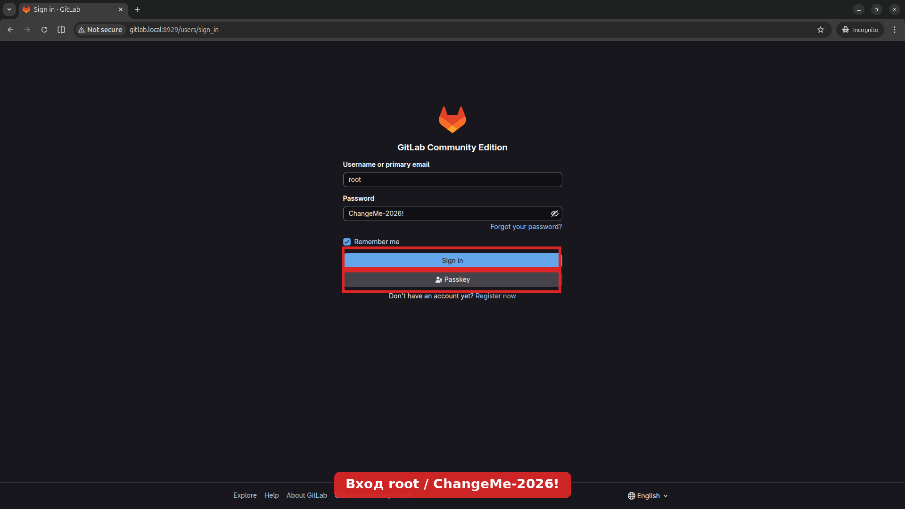

## Шаг 2. Войти как root

- **Логин:** `root`
- **Пароль:** `ChangeMe-2026!` (задан в `gitlab-compose.yml`)

После входа вы окажетесь на главной странице GitLab.

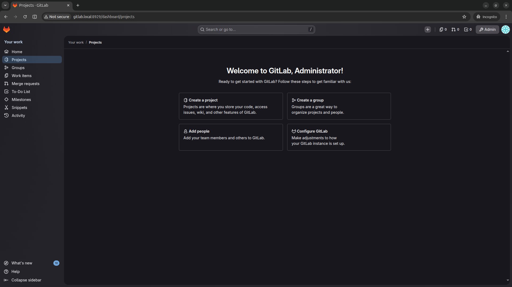

## Шаг 3. Создать новый проект

Меню слева → **Projects** → **New project** → **Create blank project**.

- Project name: `lab2-mlops`
- Visibility: **Private** (или Internal — не Public)
- **Снимите галку** «Initialize repository with a README» — мы зальём свои файлы.

Нажмите **Create project**.

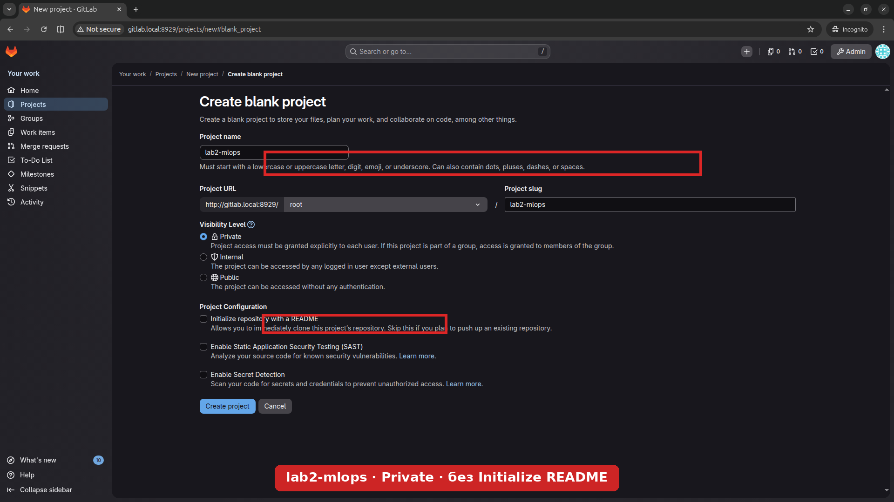

После создания GitLab покажет страницу проекта с инструкциями по push кода. Запомните URL вида `http://gitlab.local:8929/root/lab2-mlops.git`.

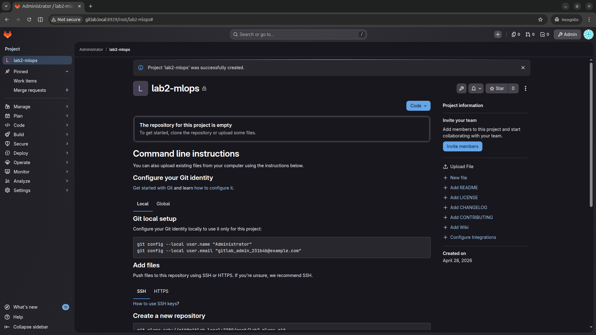

## Шаг 4. Зарегистрировать GitLab Runner

Runner — это процесс, который выполняет ваши job'ы. Он уже запущен в Docker (см. `gitlab-compose.yml`), но его нужно «привязать» к проекту.

### 4.1. Получить registration token

В вашем проекте: **Settings** (внизу слева) → **CI/CD** → секция **Runners** → **New project runner**.

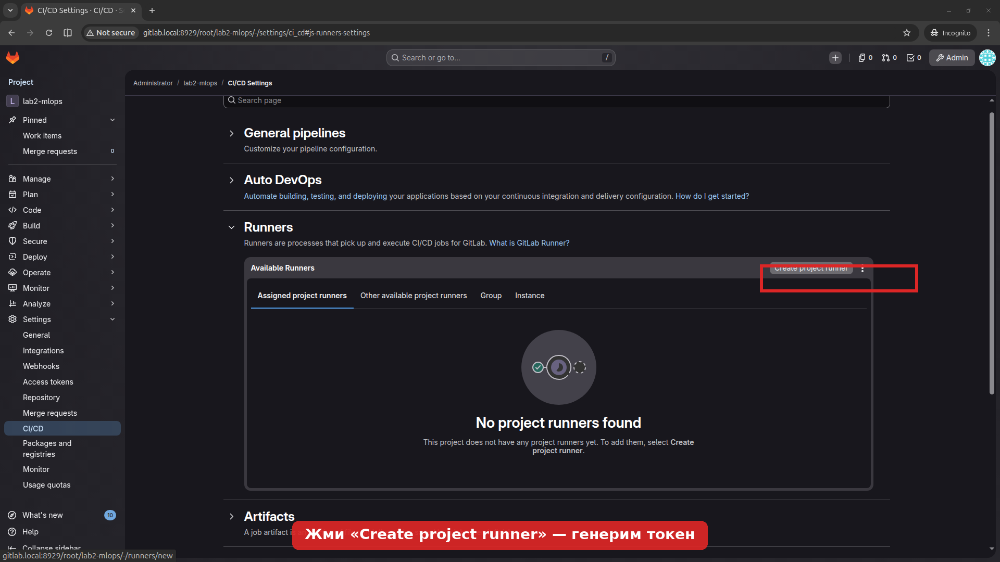

Заполните форму:
- **Tags:** `docker` (одна метка, важно для соответствия с `.gitlab-ci.yml`)
- **Run untagged jobs:** ✓ включить
- остальное — по умолчанию

Нажмите **Create runner**. GitLab покажет токен вида `glrt-xxxxxxxxxx` — **скопируйте его**.

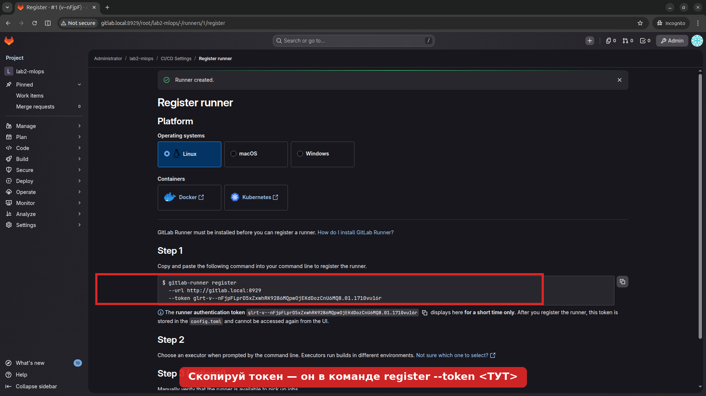

### 4.2. Зарегистрировать runner-контейнер

В терминале (там же, где `gitlab-compose.yml`):

```bash
docker exec -it gitlab-runner gitlab-runner register \
  --non-interactive \
  --url http://gitlab.local:8929/ \
  --token <ВАША_ТОКЕН_ИЗ_GITLAB> \
  --executor docker \
  --docker-image python:3.12-slim \
  --description "local-docker-runner" \
  --docker-network-mode gitlab-net
```

> `--docker-network-mode gitlab-net` важен — без него спавненные runner'ом контейнеры не смогут достучаться до `gitlab.local`.

Перезагрузите страницу Runners в GitLab — runner должен появиться со статусом «online» (зелёный кружок).

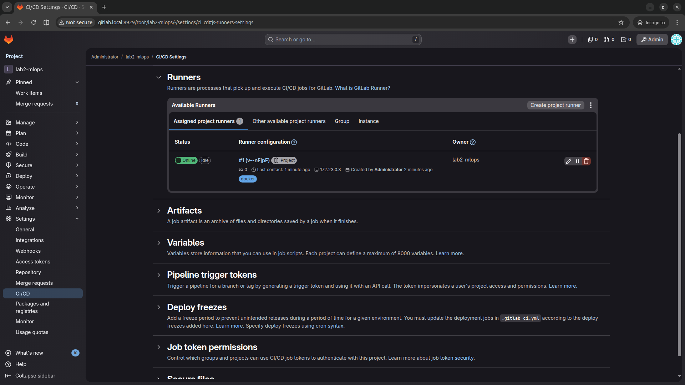

## Шаг 5. Залить код в проект

Подготовьте свою папку с проектом lab2 (только содержимое `lab2/`, **без** `gitlab-compose.yml`):

```bash
cd /tmp
mkdir lab2-mine && cd lab2-mine
# скопируйте сюда: data_collection.py, data_preprocessing.py, model_training.py,
#   model_testing.py, requirements.txt, Dockerfile, .dockerignore,
#   .gitignore, .gitlab-ci.yml, ci_lint.py
# (всё, кроме gitlab-compose.yml и README.md — README студент пишет сам)
```

Инициализируйте git и push:

```bash
git init -b main
git add .
git commit -m "lab2: initial pipeline"
git remote add origin http://root@gitlab.local:8929/root/lab2-mlops.git
git push -u origin main
# Пароль при push — тот же ChangeMe-2026!
```

GitLab сразу запустит pipeline. Перейдите в проект → **Build** → **Pipelines**.


## Шаг 6. Проверить результаты

Дождитесь завершения всех 4 стейджей (~2-3 минуты на первом прогоне из-за `pip install`). Все должны быть зелёными:

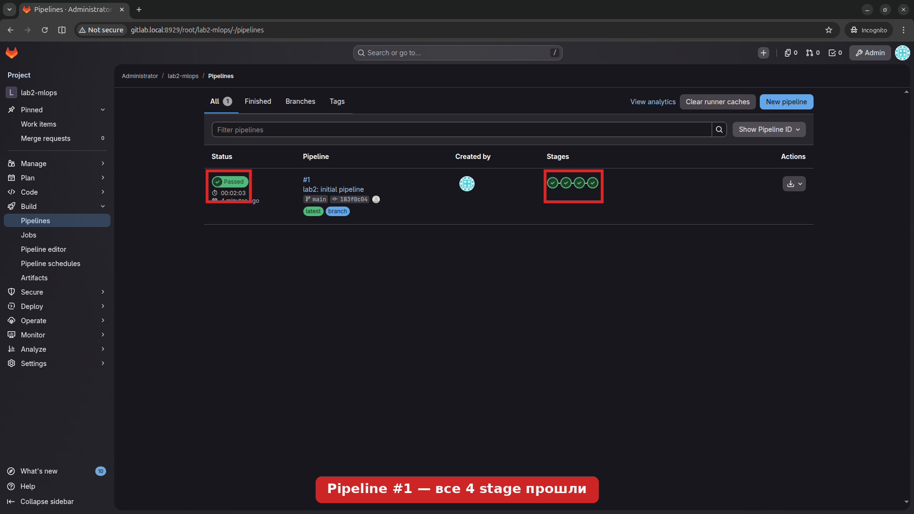

Кликните на job `test` → справа **Job artifacts** → **Browse** → `logs/evaluation_report.txt`. Там метрики:

```
Accuracy:  0.8268
Precision: 0.8065
Recall:    0.7246
F1 Score:  0.7634
ROC AUC:   0.8277
```

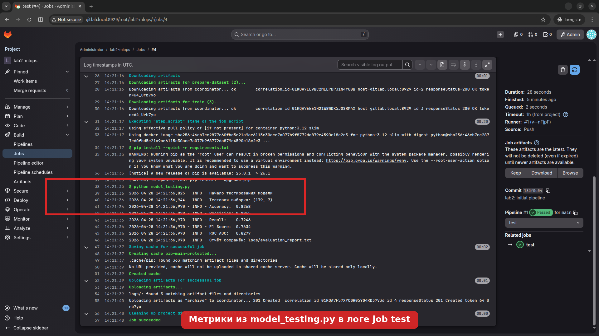
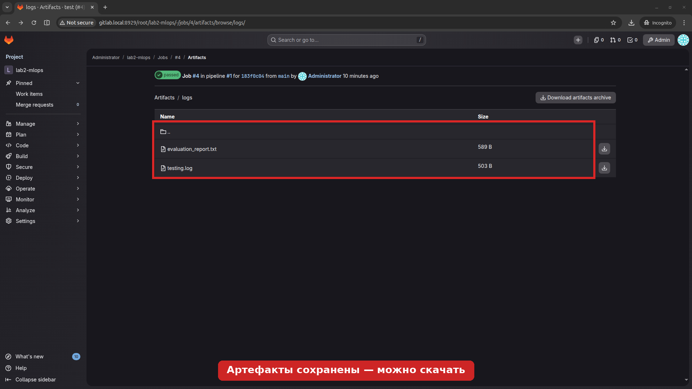

---

## Линтер `.gitlab-ci.yml`

`ci_lint.py` проверяет, что в `.gitlab-ci.yml`:
1. объявлены обязательные стейджи: `prepare-dataset`, `train`, `test`;
2. в каждом из них есть хотя бы один job.

Запуск отдельно от CI:

```bash
pip install pyyaml
python ci_lint.py .gitlab-ci.yml
```

Exit code: `0` — порядок, `1` — нарушения. В CI линтер запускается первым stage (`lint`) и валит сборку, если структура неправильная.

**Демо-сломайте** — удалите строку `- test` из секции `stages:` в `.gitlab-ci.yml`, закоммитьте и запушьте — увидите красный stage `lint`:

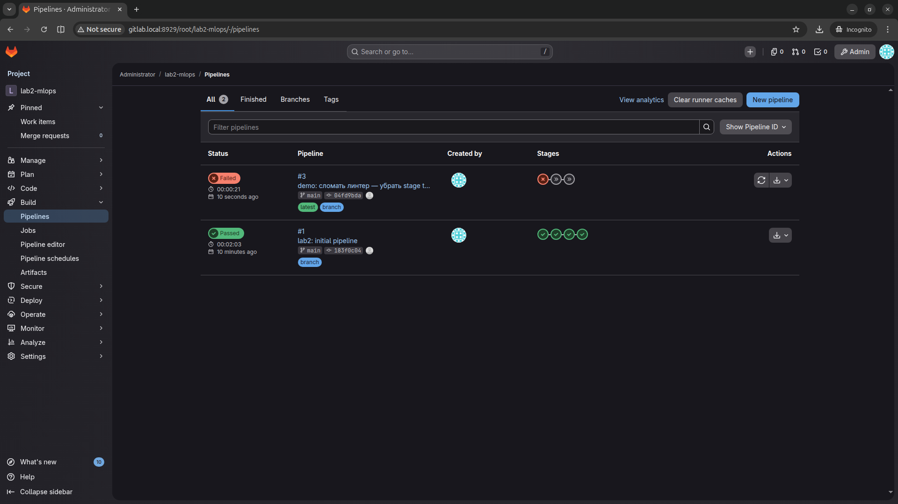

---

## Структура `.gitlab-ci.yml` — что в каком stage

| Stage | Что | Скрипты | Артефакты |
|-------|-----|---------|-----------|
| `lint` | Валидация структуры YAML | `python ci_lint.py` | — |
| `prepare-dataset` | Сбор + предобработка данных | `data_collection.py` → `data_preprocessing.py` | `data/` |
| `train` | Обучение моделей | `model_training.py` | `models/` |
| `test` | Метрики и отчёт | `model_testing.py` | `logs/` |

`needs:` между job'ами выстраивает DAG, поэтому `train` дожидается `prepare-dataset`, `test` — обоих.

---

## Если что-то пошло не так

| Проблема | Решение |
|----------|---------|
| GitLab не открывается на 8929 | Подождите ещё минуту, GitLab инициализируется до 5 мин на первом старте |
| `Could not resolve host: gitlab.local` | Не добавлена строка в `/etc/hosts`, см. Шаг 1 |
| Runner offline в UI | Проверьте `docker logs gitlab-runner`. Часто — забыли `--docker-network-mode gitlab-net` |
| Job упал на `pip install` | Может тормозить сеть к pypi; перезапустите job (Retry) |
| Push спрашивает пароль и не принимает | Используйте логин `root` и пароль `ChangeMe-2026!` (можно поменять в Settings → Profile) |
| `accuracy < 0.7` | Это норм — небольшая случайность за счёт LabelEncoder, но если сильно меньше — проверьте, что `random_state=42` в `train_test_split` и моделях |

---

## Сворачивание окружения

```bash
cd ~/gitlab-local
docker compose -f gitlab-compose.yml down          # выключить
docker compose -f gitlab-compose.yml down -v       # выключить и удалить ВСЕ данные GitLab
```
